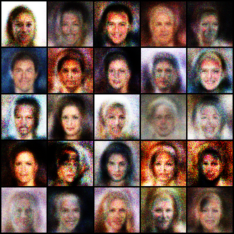

# 🎭 CelebA Vanilla GAN

A Deep Learning project implementing a Vanilla GAN using PyTorch to generate human face images trained on the CelebA dataset.

## 🚀 Features

- Vanilla GAN implementation from scratch
- Trained on CelebA dataset
- Image preprocessing pipeline
- Generator and Discriminator networks
- Generated face samples
- PyTorch based implementation

## 🛠 Tech Stack

- Python
- PyTorch
- Torchvision
- PIL
- Jupyter Notebook

## 📂 Project Structure

```text
CelebA-Vanilla-GAN/
│
├── vanilla_gan.ipynb
├── samples/
│   └── generated_faces.png
├── README.md
├── requirements.txt
└── .gitignore
```

## 📸 Generated Samples



## Dataset

CelebA Dataset was used for training.

Dataset is excluded from the repository due to size limitations.

## Installation

```bash
git clone https://github.com/riyakandwal/CelebA-Vanilla-GAN.git

cd CelebA-Vanilla-GAN

pip install -r requirements.txt
```

## Future Improvements

- DCGAN
- WGAN
- Progressive GAN
- StyleGAN

---

Built with PyTorch ❤️
